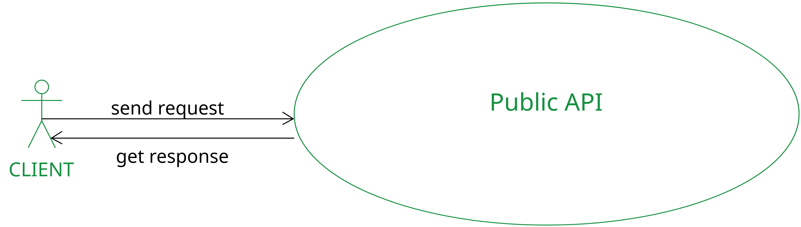
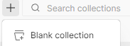
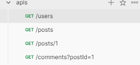
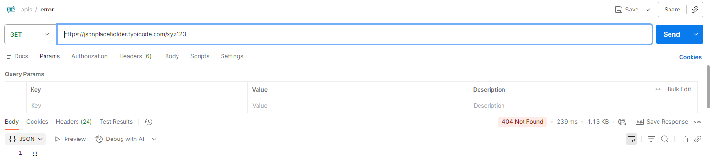
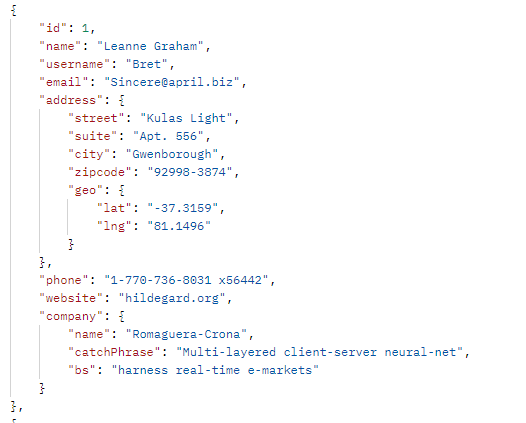
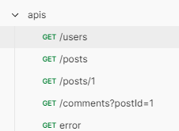

# Práctica 1. Consumir y analizar una API pública

Probarás una API pública para entender su funcionamiento.

## Objetivos
- Consumir una API real.
- Analizar sus respuestas HTTP.
- Entender métodos, códigos de estado, headers y cuerpos de respuesta.
- Identificar buenas prácticas básicas.
- Aprender las bases del consumo de API

---
<!--Este fragmento es la barra de 
navegación-->

<div style="width: 400px;">
        <table width="50%">
            <tr>
                <td style="text-align: center;">
                    <a href=""></a>
                    <br>anterior
                </td>
                <td style="text-align: center;">
                   <a href="../README.md">Lista Laboratorios</a>
                </td>
<td style="text-align: center;">
                    <a href="../Capitulo2/"></a>
                    <br>siguiente
                </td>
            </tr>
        </table>
</div>

---



## Instrucciones 
**Paso 1.** Entra a la siguiente API pública:

[https://jsonplaceholder.typicode.com/users](https://jsonplaceholder.typicode.com/users)

**Paso 2.** Desde tu navegador, explora el recurso **`/users`**.

**Paso 3.** Responde a las siguientes preguntas:
- ¿Qué método HTTP utilizó el navegador?
- ¿Qué código de estado regresó el servidor?
- ¿Que formato tiene la respuesta? (JSON, XML, etc.).

**Paso 4.** Guarda las respuestas en un archivo de texto, se comentará en clase.

**Paso 5.** Abre una herramienta profesional: **Postman**.


**Paso 6.** Crea una colección en la herramienta de **Postman**.



**Paso 7.** Realiza las siguientes peticiones:
    - **GET**: */posts*
    - **GET**: */posts/1*
    - **GET**: */comments?postId=1*



**Paso 8.** Registra en un documento de texto lo siguiente: 
    - Código de estado (200, 404, etc.).
    - Headers importantes (Content-Type, Server, Date).
    - Tiempo de respuesta.
    - Tipo de datos devueltos.

**Paso 9.** <ins>Prueba un error</ins>: envía un GET a una ruta inexistente:

```bash
GET https://jsonplaceholder.typicode.com/xyz123
```

**Paso 10.** Observa lo siguiente:
    - Código de estado.
    - Mensaje de error.
    - Cómo responde la API ante recursos inexistentes.



**Paso 11.** Analiza la estructura de un recurso. Con el endpoint `/users`, analiza: 
    - ¿Qué campos incluye cada usuario?
    - ¿Tiene datos anidados? (Por ejemplo: address.geo.lat).
    - ¿Qué tipo de datos es cada campo?

    

**Paso 12.** Explica qué aprendiste.
    - ¿Qué es un recurso en una API REST?
    - ¿Cómo se diferencian rutas, parámetros y query strings?
    - ¿Qué te indicó el código de estado?
    - ¿Por qué es importante usar herramientas como Postman?

## Resultado esperado
- Tanto en el **navegador web** como en la herramienta **Postman** se debería de observar una salida similar a lo siguiente: 


