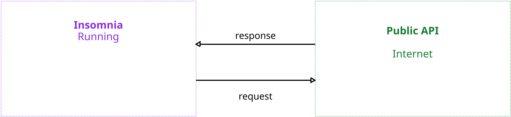
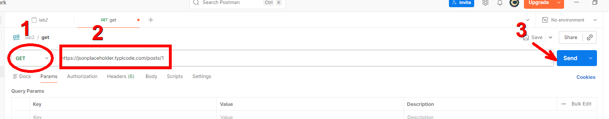
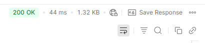
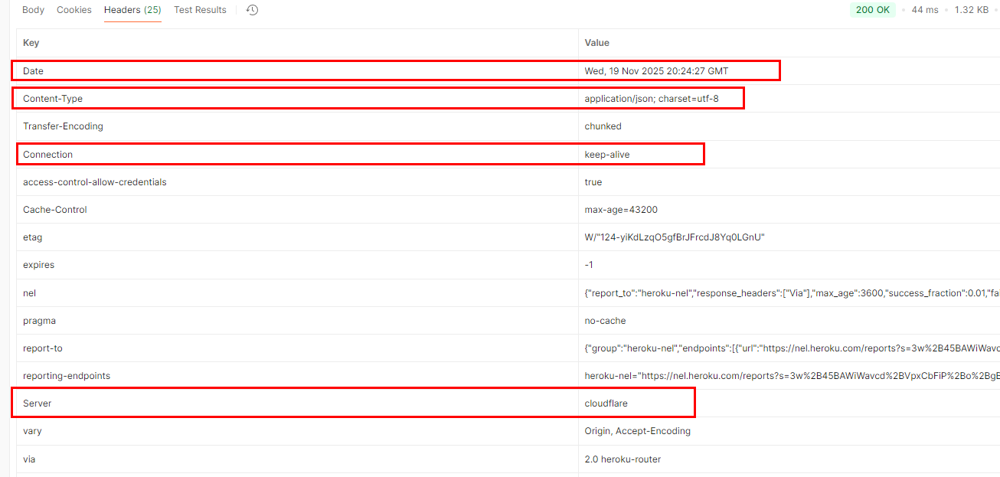
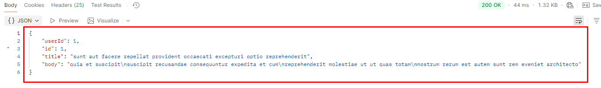
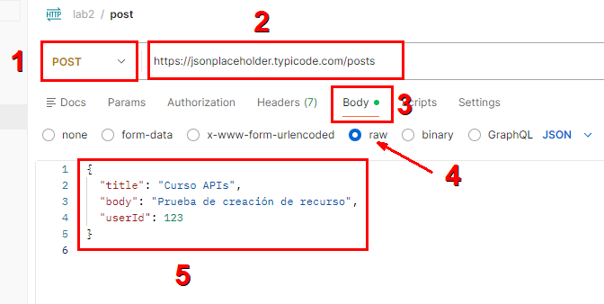
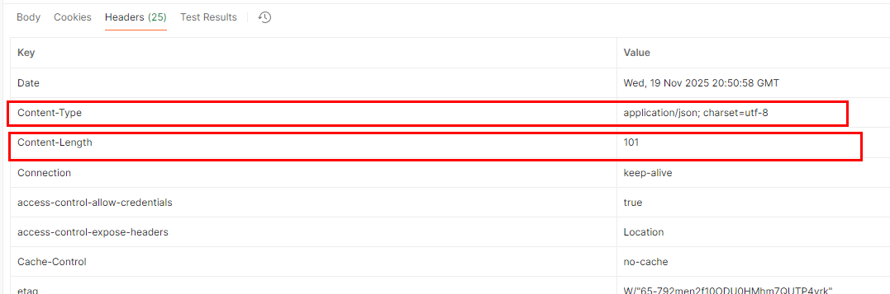
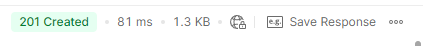
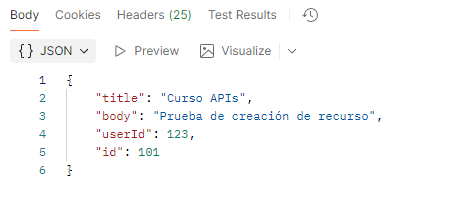
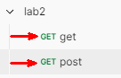

# 2. Explorando una petición HTTP completa usando POSTMAN y cURL
En este laboratorio se espera que el participante identifique y analice los componentes de una petición HTTP (método, URL, headers, body) y comprenda la estructura de una respuesta HTTP (código de estado, headers y cuerpo de respuesta).


## Objetivos
- Identificar los componentes de un HTTP request
- Comprender la estructura de una respuesta HTTP.
- Analizar códigos de estado, headers y cuerpo de respuesta

---
<div style="width: 400px;">
        <table width="50%">
            <tr>
                <td style="text-align: center;">
                    <a href="../Capitulo1/"></a>
                    <br>anterior
                </td>
                <td style="text-align: center;">
                   <a href="../README.md">Lista Laboratorios</a>
                </td>
<td style="text-align: center;">
                    <a href="../Capitulo3/">
                    </a>
                    <br>siguiente
                </td>
            </tr>
        </table>
</div>

---

## Diagrama



<br>


## Instrucciones

---
### Enviar una petición GET
1. Abrir **Postman**
2. Crear una nueva colección que llamaremos **lab2**
3. Seleccionar el método **GET**
4. En el campo **URL**, escribir:

```bash
https://jsonplaceholder.typicode.com/posts/1
```

5. No enviar headers ni body adicionales

6. Hacer click enviar




### Analiza la respuesta de la petición GET
Despúes de enviar la petición debes de identificar:

1. Código de estado:
    - Verifica si el API regresó un 200 OK.



2. Headers de respuesta, debes de localizar lo siguiente:

    - Content-Type
    - Connection
    - Date
    - Server



3. Cuerpo (body) de la respuesta, identifica lo siguiente:
    - userId
    - id
    - title
    - body


---

---
### Enviar una petición POST con body JSON
1. Dentro de la misma colección crea una nueva petición.

2. Seleccionar el método **POST**.

3. Escribe la siguiente URL

```bash
https://jsonplaceholder.typicode.com/posts
```
4. Ir a la pestaña de **body**->**raw**->**JSON** 
5. Escribir el siguiente **JSON**

```json
{
  "title": "Curso APIs",
  "body": "Prueba de creación de recurso",
  "userId": 123
}
```
6. Enviar la petición



### Analizar el resultado del POST

El alumno debe de identificar lo siguiente: 

1. **Headers enviados por el servidor**
    - Content-Type: application/json
    - Content-Length



2. **Código de estado esperado**
    - 201 Created



3. **Body Esperado**: El API debe de regresar el objetivo enviado, agregando un campo *id*.




---

## Resultado esperado

Al final el alumno debería de tener los 2 request de HTTP en postman. 



