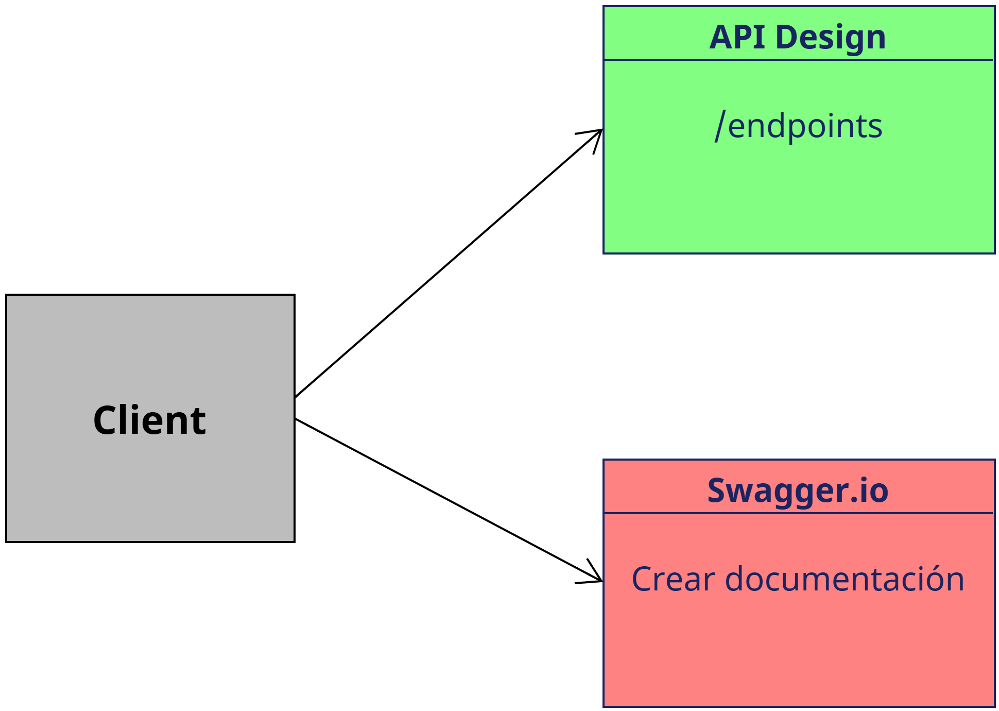
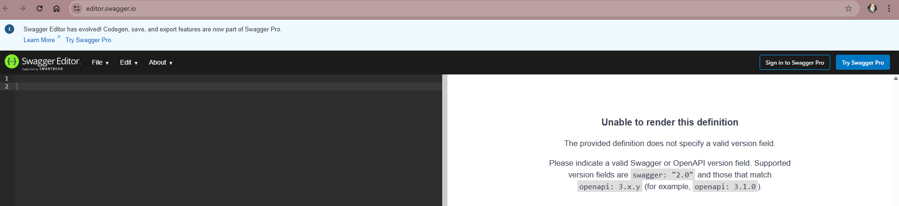
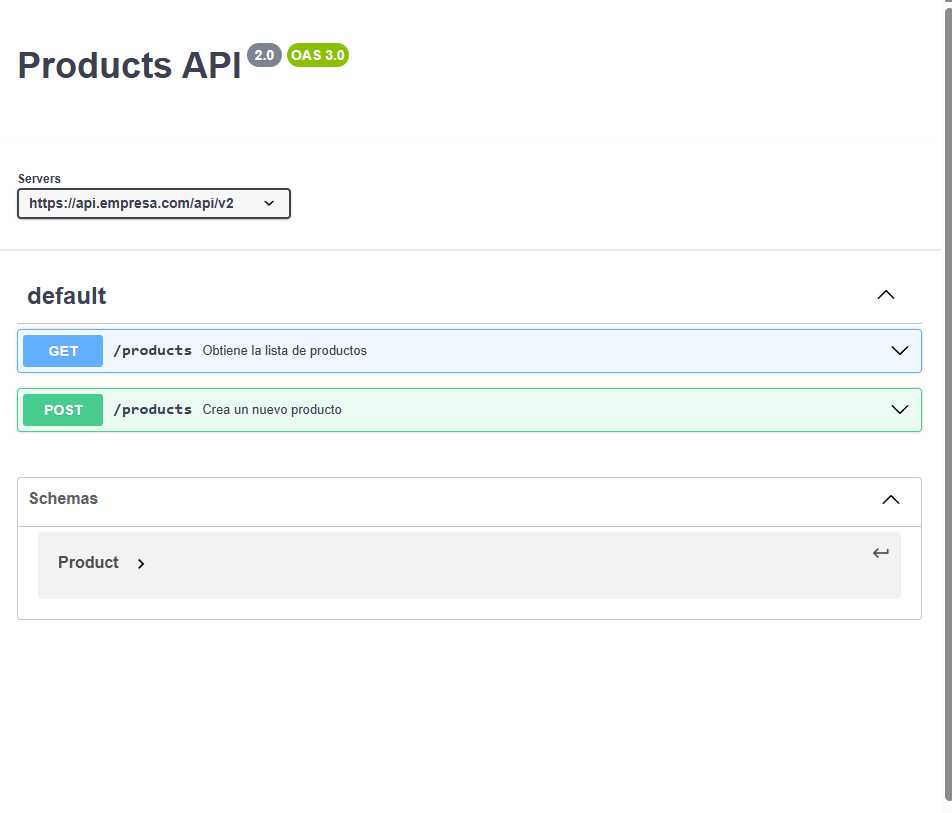
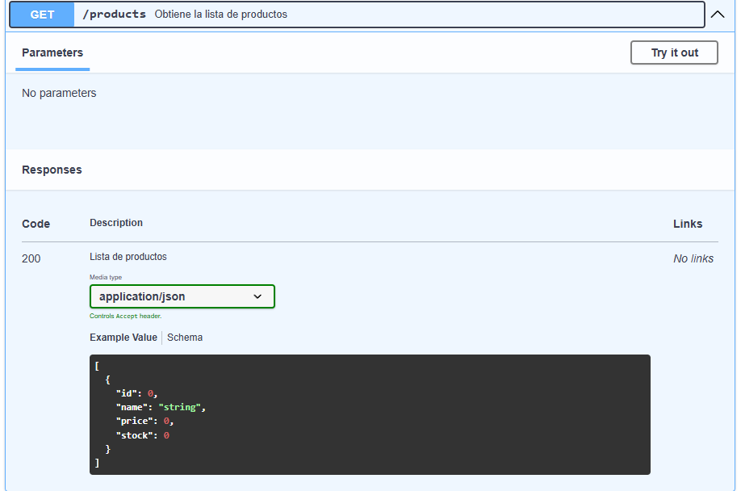
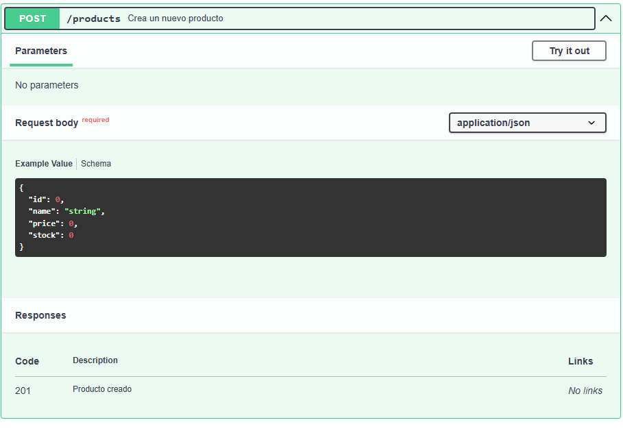
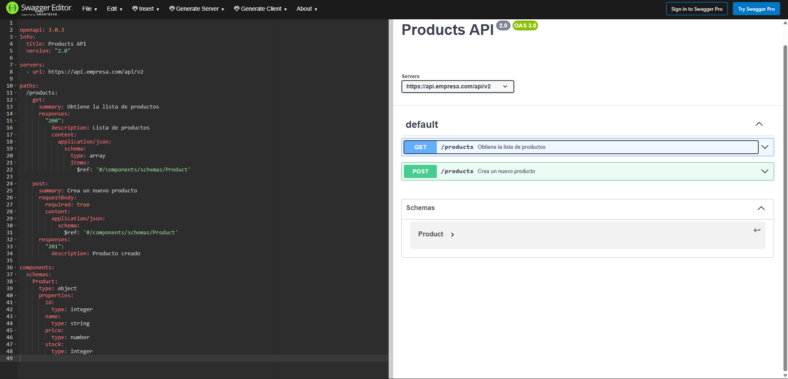

# 3. Diseñando endpoints, versionamiento y documentación de un API
El alumno aprenderá a diseñar endpoints, versionamiento de una API para una empresa que requiere la gestión de productos y categorías. 

## Objetivos
- Diseñar una API versionada correctamente.
- Estructurar recursos, subrecursos y parámetros.
- Diferenciar entre versionamiento por path, header y param.
- Documentar un servicio siguiendo buenas prácticas oficiales.


---

<div style="width: 400px;">
        <table width="50%">
            <tr>
                <td style="text-align: center;">
                    <a href="../Capitulo2/"></a>
                    <br>anterior
                </td>
                <td style="text-align: center;">
                   <a href="../README.md">Lista Laboratorios</a>
                </td>
<td style="text-align: center;">
                    <a href="../Capitulo4/"></a>
                    <br>siguiente
                </td>
            </tr>
        </table>
</div>

---


## Diagrama




## Instrucciones

### Escenario

***La empresa tiene una API para gestionar productos y categorías.
Nueva versión (v2) agrega campo stock al producto y endpoint para búsqueda.***

---
### Diseñar un esquema de versionamiento

1. Diseñar la estructura de endpoints para v1 usando versionamiento por **path**.

2. Diseñar la estructura de endpoints para v2 agregando las mejoras.

3. Escribir ambos conjuntos de endpoints en formato de lista.


4. En un archivo escribe la propuesta de los endpoints  para la primer versión.

5. El resultado esperado debería es el siguiente para la **versión 1**:

```text
GET /api/v1/products
GET /api/v1/products/{productId}
POST /api/v1/products

GET /api/v1/categories
GET /api/v1/categories/{categoryId}
```

6. Generar los endpoints para la versión 2 siguiendo las buenas prácticas, nuevas características:

- Nuevo endpoint **/search**

```text
GET /api/v2/products
GET /api/v2/products/{productId}
POST /api/v2/products
GET /api/v2/products/search?q={query}

GET /api/v2/categories
GET /api/v2/categories/{categoryId}
```
---


---
### Documentar API (Crear un archivo OpenAPI básico)

1. Crear un archivo de openapi.yaml que documente dos endpoints:

- GET /api/v2/products
- POST /api/v2/products

2. Abrir en un navegador web con el siguiente URL:

```bash
https://editor.swagger.io/
```



3. Crear un documento OpenAPI con:
    - info
    - servers
    - paths
    - schemas (solo Product)

4. Dentro de la página de swagger.io añadir la siguiente estructura YAML:

```yaml
openapi: 3.0.3
info:
  title: Products API
  version: "2.0"

servers:
  - url: https://api.empresa.com/api/v2

paths:
  /products:
    get:
      summary: Obtiene la lista de productos
      responses:
        "200":
          description: Lista de productos
          content:
            application/json:
              schema:
                type: array
                items:
                  $ref: '#/components/schemas/Product'

    post:
      summary: Crea un nuevo producto
      requestBody:
        required: true
        content:
          application/json:
            schema:
              $ref: '#/components/schemas/Product'
      responses:
        "201":
          description: Producto creado

components:
  schemas:
    Product:
      type: object
      properties:
        id:
          type: integer
        name:
          type: string
        price:
          type: number
        stock:
          type: integer

```


5. Analizar el YAML y observar la estructura de la documentación. 

6. En **swagger.io** añadir el YAML y observar la documentación generada. 



7. Observar la documentación del **GET**



8. Documentación del **POST**




9. Cómo tarea opcional se puede agregar los demás endpoints generados. 

---


## Resultado esperado [Instrucciones](#instrucciones)

El alumno al final tendrá la documentación generada desde swagger.io.





