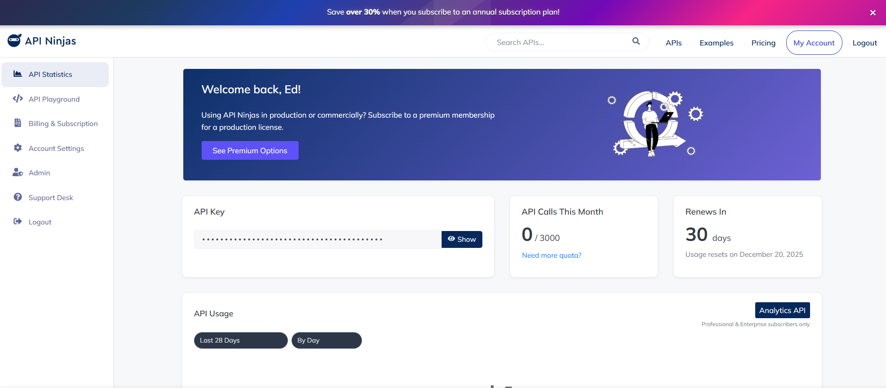
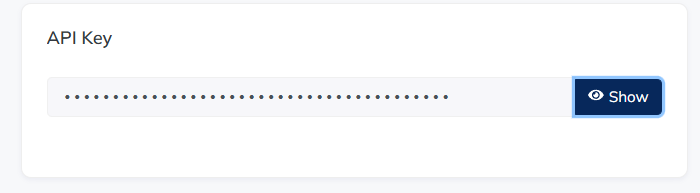
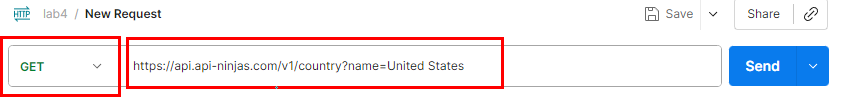
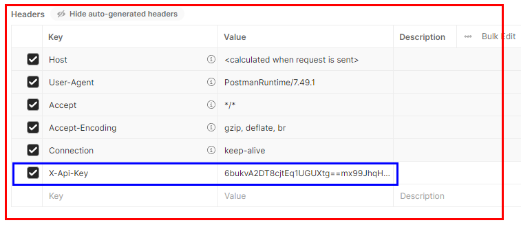
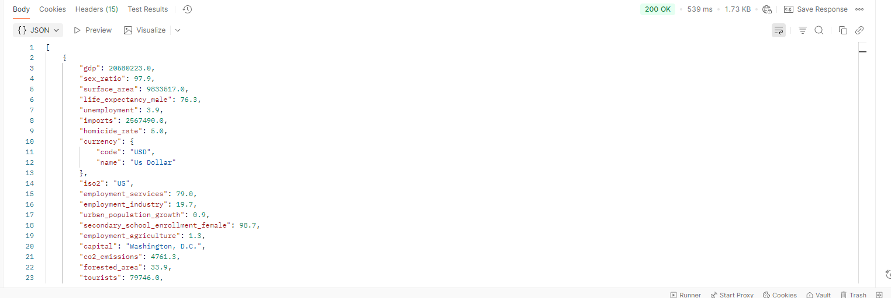
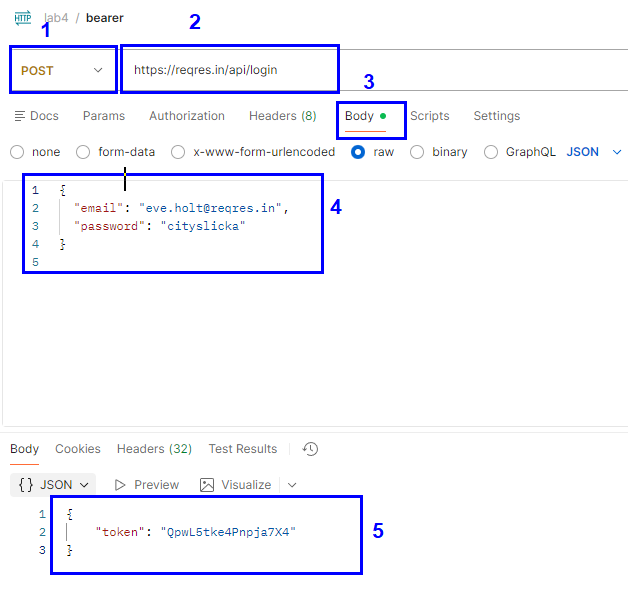
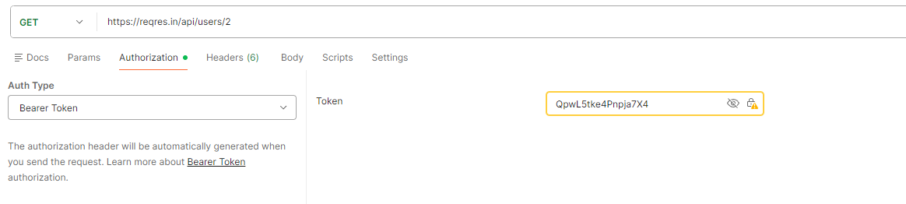
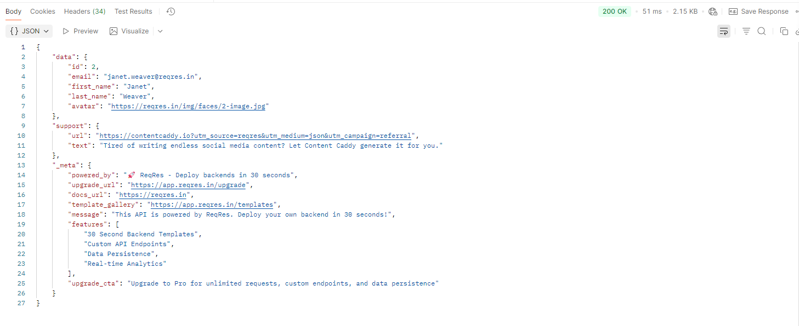
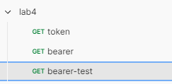

# Práctica 4. Implementando autenticación con API Key, Tokens y buenas prácticas de seguridad en APIs

Usando APIs públicas, probar los métodos de autenticación **API Key** y **Bearer Token**. Analizar los resultados. 

## Objetivos

  - Entender cómo funcionan los mecanismos de autenticación más usados en API.
  - Usar API Keys en cabeceras.
  - Usar Tokens Bearer simulando JWT.
  - Analizar respuestas de error y códigos HTTP de seguridad.

---

<div style="width: 400px;">
        <table width="50%">
            <tr>
                <td style="text-align: center;">
                    <a href="../Capitulo3/"></a>
                    <br>anterior
                </td>
                <td style="text-align: center;">
                   <a href="../README.md">Lista Laboratorios</a>
                </td>
<td style="text-align: center;">
                    <a href="../Capitulo5/"></a>
                    <br>siguiente
                </td>
            </tr>
        </table>
</div>

---


## Instrucciones

### Tarea 1. Autenticación con API Key.

Usarás la API de **API Ninjas**, que requiere API Key en la cabecera.

**Paso 1.** Crear una cuenta gratuita en:

[https://api-ninjas.com/](https://api-ninjas.com/)

**Paso 2.** Usar una cuenta de Google para registrarse.



**Paso 3.** Obtener una API Key.



**Paso 4.** En **Postman**, crear una nueva colección llamada **lab4**.

**Paso 5.** Crear una nueva petición en **Postman** con la siguiente URL:

```bash
https://api.api-ninjas.com/v1/country?name=United States
```



**Paso 6.** En los headers, agregar:

```bash
X-Api-Key: <Tu API Key>
```



**Paso 7.** Enviar la petición.



**Paso 8.** Quitar la API Key y volver a enviar. Este es el resultado:


**Paso 9.** Comparar ambas respuestas.

---

### Tarea 2. Autenticación tipo Token Bearer (simulación).

Uso del endpoint de **reqres.in**, que valida si el Token bearer existe o no.

**Paso 1.** Crear una nueva petición **POST**.
  - Este url simula la obtención del JWT para al autenticación:

```bash
https://reqres.in/api/login
```

**Paso 2.** Para que la simulación funcione bien, añadir el header:


**Paso 3.** En el body, enviar:

```json
{
  "email": "eve.holt@reqres.in",
  "password": "cityslicka"
}
```

**Paso 4.** Si se envía el request, se observará el siguiente resultado:



**Paso 5.** Hacer otra petición con el Token obtenido, con el siguiente URL:

```bash
GET https://reqres.in/api/users/2
```

**Paso 6.** Añadir el método de autenticación bearer:



**Paso 7.** Enviar el **request**:



---

## Resultado esperado

  - Obtener los siguientes **request**:


