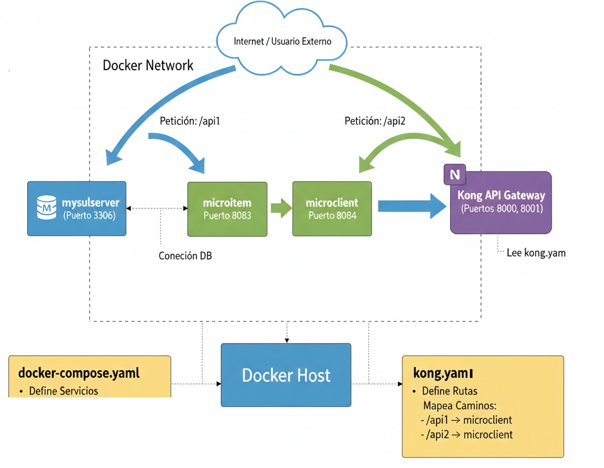
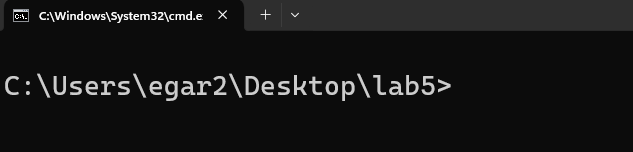
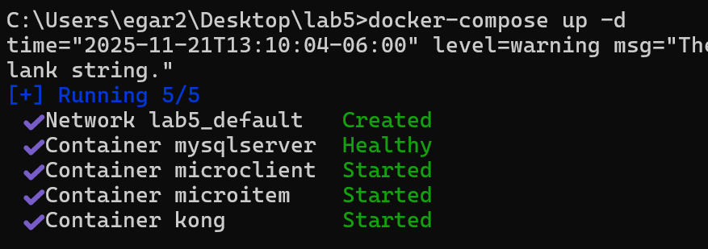
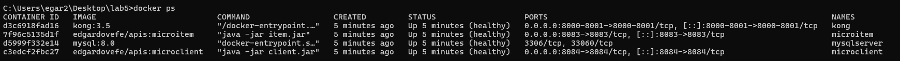
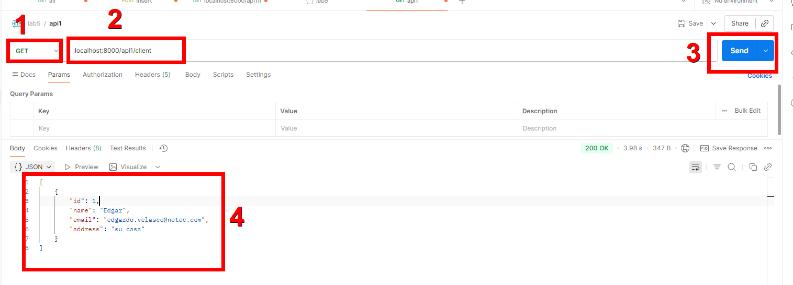
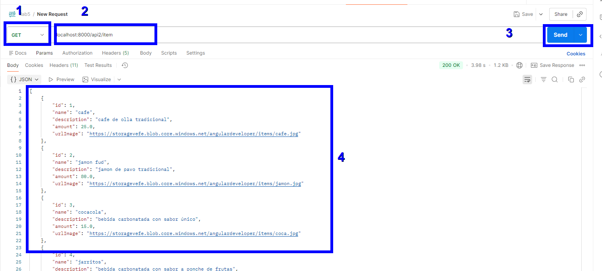
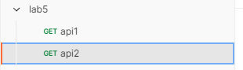

# Práctica 5. API Gateway Kong para administrar acceso a APIs

Crear una alerta que avise cuando un microservicio se ha caído.

## Objetivos

  - Configurar Kong en modo DB-less usando un archivo declarativo (**kong.yaml**).
  - Exponer los API client e item bajo un único API Gateway.
  - Validar el comportamiento del Gateway desde el punto de vista del consumidor de API.

---
<div style="width: 400px;">
        <table width="50%">
            <tr>
                <td style="text-align: center;">
                    <a href="../Capitulo4/"></a>
                    <br>anterior
                </td>
                <td style="text-align: center;">
                   <a href="../README.md">Lista Laboratorios</a>
                </td>
<td style="text-align: center;">
                    <a href="."></a>
                    <br>siguiente
                </td>
            </tr>
        </table>
</div>

---



---

⚠️ **Nota.** Asegúrate de que que esté <ins>iniciado</ins> el motor de **Docker** para que se puedan iniciar los contenedores necesarios para la práctica.

---

## Instrucciones

**Paso 1.** En el escritorio, crear una carpeta llamada **lab5**.

**Paso 2.** Dentro de la carpeta, añadir 2 archivos:

  - **docker-compose.yaml**
  - **kong.yaml**

**Paso 3.** Dentro del archivo **docker-compose.yaml**, añadir el siguiente contenido:

```yaml
services:
  mysqlserver:
    container_name: mysqlserver
    image: "mysql:8.0"
    environment:
      - MYSQL_ROOT_PASSWORD=netec123
      - MYSQL_DATABASE=items
    healthcheck:
      test: mysqladmin ping -uroot -p${MYSQL_ROOT_PASSWORD} -hlocalhost
  
  microitem:
    container_name: microitem
    image: edgardovefe/apis:microitem
    environment:
      - IP_DB=mysqlserver
      - PORT_DB=3306
      - NAME_DB=items
      - USER_DB=root
      - PASSWORD_DB=netec123
    ports:
      - 8083:8083
    depends_on:
      mysqlserver:
        condition: service_healthy
    healthcheck:
      test: curl -f http://localhost:8083/item
  
  microclient:
    container_name: microclient
    image: edgardovefe/apis:microclient
    ports:
      - 8084:8084
    healthcheck:
      test: curl -f http://localhost:8084/client
  

  kong:
    container_name: kong
    image: kong:3.5
    environment:
      KONG_DATABASE: "off"
      KONG_ADMIN_LISTEN: 0.0.0.0:8001
      KONG_DECLARATIVE_CONFIG: /kong/kong.yaml
    ports:
      - "8000:8000" # Gateway público
      - "8001:8001" # Admin
    volumes:
      - ./kong.yaml:/kong/kong.yaml:ro
    depends_on:
      - microclient
      - microitem
```

**Paso 4.** Dentro del archivo **kong.yaml**, añadir el siguiente contenido:

```yaml
_format_version: "3.0"
_transform: true

services:
  - name: clientes-service
    url: http://microclient:8084
    routes:
      - name: clientes-route
        paths:
          - /api1

  - name: items-service
    url: http://microitem:8083
    routes:
      - name: items-route
        paths:
          - /api2
```

**Paso 5.** Dentro del archivo de **kong.yaml**, ubicar lo siguiente:

  - Se definen las rutas para conectarse al API.
  - Se define el sufijo de cada ruta **/api1** para <ins>client</ins> y **/api2** para <ins>item</ins>.

**Paso 6.** Se abre una terminal dentro de la carpeta **lab5**.



**Paso 7.** Ejecutar el siguiente comando:

```bash
docker-compose up -d
```

⚠️ **Nota.** Espera a que el comando termine de ejecutarse, tardará unos minutos, ya que tiene que descargar las imágenes de cada uno de los contenedores.

**Paso 8.** Cuando el comando termine de ejecutarse, observa lo siguiente en la terminal:



**Paso 9.** Valida con el siguiente comando que los contenedores estén iniciados:

```bash
docker ps
```



**Paso 10.** Abrir **Postman** y probar el siguiente url con el método **GET** para conectarse al API client:

```bash
http://localhost:8000/api1/client
```



**Paso 11.** Abrir otro request en **Postman** y probar el siguiente url para conectarse al API item:

```bash
http://localhost:8000/api2/item
```



**Paso 12.** Observa que ambos request se conectan al mismo puerto: **8000**, porque nos conectamos por el API Gateway **kong**.

## Resultado esperado

  - Tener 2 requests que se conectan al **API Gateway Kong**


